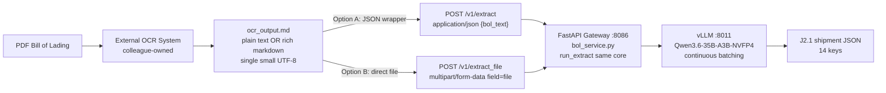

# MDPL Bill of Lading Extractor — Verified Setup Record (v3.2)

> **Source of Truth for the Builder.** Status: **VERIFIED — NO BUILD REQUIRED.**
> Verified on Windows dev machine 2026-09-15: `pytest tests/test_extract.py -q` →
> **104 passed**. This document supersedes the v3.1 *build* roadmap (the
> `POST /v1/extract_file` work is done and green) and records the spec review,
> the four Socratic decisions below, and the verification checklist.
>
> Pipeline (hardwired): `PDF → OCR (separate system, colleague-owned) → OCR output
> as .md/.txt text file → THIS gateway → J2.1 shipment JSON`.
> This gateway **never** handles PDF/image bytes and never starts/stops the model server.

---

## 1. Strategic Design

### 1.1 Spec Review (attached instruction `AI_MDPL_BILL_OF_LADING.md`, "Japan Bill of Lading Extractor v2.1")

| Spec claim | Current setup (`bol_service.py`) | Verdict |
|---|---|---|
| Objective lists 15 items incl. **Contract Class** | Code + `§5 JSON schema` + golden files have **14 keys, no Contract Class**; `§4 Extraction` also omits it | **Drift in spec Objective line only.** Decision D4 (2026-09-15): officially **DROP Contract Class**. Spec §5 is authoritative. No code change. |
| §1 Input: "text, PDF, or image" | Gateway accepts **pre-extracted text only**: JSON `{bol_text}` (`POST /v1/extract`) or UTF-8 `.md`/`.markdown`/`.txt` file (`POST /v1/extract_file`) | **Intentional scope cut.** OCR (PDF/image → .md) is the colleague's separate system. No PDF/image parsing here by design. |
| §3 Customer table (C0002/C0003/C0005/C0006) | `DEFAULT_CUSTOMER_TABLE` matches exactly; config-overridable via `CUSTOMER_TABLE` env; tolerant matching + ambiguity guard | ✅ Match. Gateway lookup is authoritative (overrides model). |
| §4 Extraction fields (BLNumber alphanumeric-only, BLDate split, VoyageNumber "N/A" fallback, Brand from Marks & Numbers, etc.) | All encoded in `BOL_SYSTEM` + `_normalize_bol` + `lookup_customer` | ✅ Match. |
| §4 "Ocean Vessel" vs §5 "ShipVia" naming | Code uses `ShipVia` (== §5 schema) | ✅ §5 wins. Documented, no change. |
| §5 JSON schema (14 keys, nested `BLDate` + `ShipToDestination`) | `_normalize_bol` is authoritative: forces `AssistantVersion="J2.1"`, drops unknown keys, coerces types | ✅ Exact match (`bol_golden_expected.json` is contract-exact). |
| §6 Error handling "null or N/A" | Code uses `"N/A"` strings + `0` numerics, nested objects always present | **Decision D6: KEEP `N/A + 0`.** Rationale: JSON schema has no nullable union; `0`/`"N/A"` are fail-safe downstream; all 104 tests pin this. Spec "null" option formally declined. |
| §7 Output "formatted JSON only" | `extract_json` strips thinking blocks + code fences, locates `{…}`, fails closed (`503`, never fabricates) | ✅ Match (strictly stronger than spec). |

### 1.2 Objectives (v3.2 — verification round)

1. **Lock the contract:** 14-key J2.1 schema, `AssistantVersion` always `"J2.1"`, placeholders `N/A`/`0`. Contract Class stays out.
2. **Lock dual-format ingest:** gateway accepts **both plain text AND rich markdown** `.md` (tables, `#`, `|`, `**`, Japanese) with **zero preprocessing** — content is opaque inside `<<<BOL_DATA>>>` fences. Verified by design + parity test (see §1.6 / Roadmap V3).
3. **Prove backward compatibility:** `POST /v1/extract` (JSON) and `POST /v1/extract_file` (multipart `file`) converge on the **same** `run_extract` core and return bit-identical J2.1 JSON.
4. **Stay gateway-only:** vLLM `:8011` (`Qwen3.6-35B-A3B-NVFP4`, `CONTEXT_SIZE=32768`) is shared and pre-existing; no model/port/schema change in this round.
5. **Leave docs + code untouched** except this file (Decision D7: verify + document only). Known README staleness (ports `8006`/`Qwen3.8-27B`/`65536` in Port Map / Config / Context sections vs live `8011`/`Qwen3.6`/`32768`) is **logged as tech debt, not fixed in this round**.

### 1.3 Architecture



**Request flow inside gateway (both endpoints converge):**

```text
POST /v1/extract         ─┐
  {bol_text: str}         ├─→ load_customer_table() → run_extract({bol_text}, table, http_model_call)
POST /v1/extract_file    ─┘         ↑                                              ↑
  file: UploadFile (.md) ── _read_md_upload() ── {bol_text: decoded str} ─────────┘
                                                    (build_prompt → check_context → model_call → extract_json)
```

**Why plain + rich markdown both work (no code change):** `build_prompt()` wraps
the decoded file verbatim in `<<<BOL_DATA>>> … <<<END_BOL_DATA>>>` delimiter
fences. Markdown syntax is never interpreted — it is opaque document text to the
model. `bol-prompts.md:98-101` already records this. A rich-markdown sample
(`#`, `| table |`, `**bold**`, Japanese) therefore needs no preprocessing,
no prompt change, and no new dependency.

### 1.4 API Definitions

All endpoints require `x-api-key` except `GET /` and `GET /healthz`. Docs at `/docs`.
`GET /v1/extract*` intentionally does **not** exist (`405` is correct).

| Endpoint | Method | Request | Success | Notes |
|---|---|---|---|---|
| `/` | GET | — | `200 {service, version, endpoints, docs}` | Lists all 5 endpoints incl. `/v1/extract_file` |
| `/healthz` | GET | — | `200 {status, model_server, context_budget, version}` | Gateway-only liveness; `degraded` when vLLM down |
| `/v1/extract` | POST | `application/json {"bol_text": string(min 1)}` | `200 J2.1 JSON` | Unchanged; `GET` → `405` |
| `/v1/extract_file` | POST | `multipart/form-data`, single field `file: (.md/.markdown/.txt)` UTF-8, non-empty, size-capped | `200 J2.1 JSON` (identical schema) | `GET` → `405`; plain **or** rich markdown accepted |
| `/v1/extract_batch` | POST | `{"entries": [{id?, bol_text}]}` | `200 {results: [{id, status, data/error}]}` | Sequential, per-entry isolation |
| `/v1/version` | POST | — | `200 {"version": "J2.1"}` | Never touches the model; `GET` → `405` |

`POST /v1/extract_file` server behavior (unchanged, verified): field must be
exactly `file` (else `422`); extension allowlist `.md`/`.markdown`/`.txt`
case-insensitive (else `422`); size cap `usable_prompt_room()*3` chars (~84,648
at defaults) pre- and post-decode (else `422`); UTF-8 strict decode (else `422`);
empty/whitespace-only reject (`422`); then identical `run_extract` downstream
(`422` guard / `503` model / `500` unexpected). Uploads never touch disk; only
basename + char count logged.

### 1.5 Data Schemas

**J2.1 output (authoritative — `_normalize_bol`, 14 keys, Contract Class excluded):**

```json
{
  "AssistantVersion": "J2.1",
  "BLNumber": "string",
  "BLDate": { "Month": 0, "Day": 0, "Year": 0 },
  "CustomerName": "string",
  "CustomerCode": "string",
  "CustomerAddress": "string",
  "Shipper": "string",
  "ShipperAddress": "string",
  "ShipToDestination": { "City": "string", "Country": "string" },
  "ShipVia": "string",
  "VoyageNumber": "string",
  "Brand": "string",
  "PortOfOrigin": "string",
  "Cartons": 0
}
```

Placeholders: `"N/A"` strings, `0` numerics, nested objects always present.
`AssistantVersion` forced to `"J2.1"`. Gateway `lookup_customer` overrides model
`CustomerCode`. Unknown keys dropped.

**Inputs:**

```python
class ExtractRequest(BaseModel):
    bol_text: str = Field(..., min_length=1)

# extract_file is NOT a pydantic model — FastAPI UploadFile signature:
# async def extract_file(file: UploadFile = File(...), _api_key: str = Depends(verify_api_key))
# validation lives in _read_md_upload(file) -> str
```

### 1.6 Constraints (C1–C8 carried from v3.1 + D4–D7 new)

- **C1. POST-only is intentional.** No GET handlers will be added (no body semantics, URL limits, PII in logs).
- **C2. Input is single small UTF-8 `.md`/`.txt` (plain OR rich markdown).** No PDF/image bytes; no batch-file endpoint (batch callers use `POST /v1/extract_batch`).
- **C3. Reuse, don't fork.** `extract_file` calls `run_extract` — no duplicate prompt/sanitization logic, no schema fork.
- **C4. Gateway-only, shared vLLM.** `MODEL_URL (:8011)`, `MODEL_NAME (Qwen3.6-35B-A3B-NVFP4)`, `CONTEXT_SIZE (32768)`, `API_PORT (8086)`, `REQUEST_TIMEOUT (120)`, 2-level `chat_template_kwargs` degradation — all frozen.
- **C5. Backward compatible.** Existing `/v1/extract` clients/tests pass untouched; no new required `.env` var (`test_defaults_sync_to_env_example` green).
- **C6. Auth + status ladder preserved:** wrong method `405` → bad key `401` → bad body/file `422` → guard/model fail `422`/`503` → unexpected `500`.
- **C7. Dependency minimal:** `python-multipart` only (already in `requirements.txt`).
- **C8. Windows-dev testable:** full suite green with stub backend, no GPU/vLLM.
- **C9 (D4). Contract Class officially dropped.** Spec §5 (14 keys) is authoritative over spec Objective prose. Revisit only if Japan ops supplies a field definition + golden sample.
- **C10 (D5). Dual-format support is by-design, not by-preprocessing.** Plain text and rich markdown both pass through byte-identical; markdown tokens count toward the same context budget.
- **C11 (D6). Placeholders `N/A + 0` are contractual.** Spec "null" alternative declined; downstream must handle `"N/A"`/`0`, not `null`.
- **C12 (D7). Verify + document only.** No code/doc edits in this round besides this file. README drift (§1.2-5) logged, deferred.

### 1.7 Edge Cases & Failure Modes

| Scenario | Handling |
|---|---|
| `GET` on any `/v1/extract*` or `/v1/version` | `405 + Allow: POST` (Starlette default). Expected; use POST. |
| Missing `file` field / wrong field name | `422` (FastAPI validation). |
| Wrong extension (`.pdf`, `.png`, `.docx`, none) | `422 "Unsupported file type …"`. Never sniff/convert PDF. |
| Empty (0 bytes) / whitespace-only `.md` | `422` (mirrors `min_length=1`). |
| Non-UTF-8 bytes | `422 "File must be UTF-8 …"`. No `shift_jis` fallback (single UTF-8 only). |
| Oversized `.md` (> `usable_prompt_room()*3` chars) | `422` pre-model-call with sizing guidance; honors `CONTEXT_GUARD` strict/warn/off. |
| Prompt over budget after size cap (system + table overhead) | `422` from `check_context` — defense in depth. |
| **Rich markdown** (`#`, `\| tables`, `**bold**`, Japanese, newlines) | **Harmless — verbatim inside `<<<BOL_DATA>>>` fences.** No stripping (stripping would destroy Marks & Numbers layout). Counts toward token budget like plain text. |
| Noisy OCR (extra whitespace, `l`/`1` confusions, split lines) | Passed verbatim; model is tolerant; `BLNumber` sanitizer keeps letters+numbers contract via prompt rule; unparseable → `N/A`/`0`, never invented. |
| vLLM down / timeout / unparseable JSON | `503` fail-closed (`ModelUnavailable`/`ContextExceeded`). |
| Missing/invalid `x-api-key` | `401` via `verify_api_key` (all POST routes). |
| Filename traversal / weird chars / log injection | Ignored except extension check; never written to disk; basename-only logging, never file contents at INFO. |
| Ambiguous customer (two codes match) | `"N/A"` — never guess; `CustomerName` kept verbatim. |

---

## 2. The Execution Roadmap — Verification Checklist (v3.2)

> Sequential. All items verified 2026-09-15 on Windows (stub backend, no GPU).
> Nothing left to build — Builder: **do not write code** unless a check below fails.

### Phase V0: Decisions (done — from Socratic interrogation 2026-09-15)

- [x] **D4. Contract Class → DROP.** Keep 14-key J2.1 schema; no code/test/golden change.
- [x] **D5. Dual-format → PLAIN + RICH MARKDOWN both accepted.** No preprocessing; fencing handles both. Parity covered by V3 below.
- [x] **D6. Placeholders → KEEP `N/A + 0`.** Spec "null" declined; downstream contract unchanged.
- [x] **D7. Scope → VERIFY + DOCUMENT ONLY.** This file is the only change in this round.

### Phase V1: Suite green (verified)

- [x] **V1.** `python -m pytest tests/test_extract.py -q` → **104 passed** (6 pre-existing deprecation warnings: `httpx/starlette.testclient`, `HTTP_422_*` rename — cosmetic only).
  Verify: rerun `pytest -v`; expect `104 passed`.

### Phase V2: Contract parity (verified by suite)

- [x] **V2a.** `TestGoldenSample::test_extract_returns_contract_exact_json` — `POST /v1/extract` golden `.txt` → `200` + body == `bol_golden_expected.json` (`BL YKO2604155`, `C0003`).
- [x] **V2b.** `TestExtractFile::test_file_happy_path_parity` — same golden bytes via `POST /v1/extract_file` (`ocr.md`) → `200` + identical body. Proves JSON and file paths converge.
- [x] **V2c.** `test_root_lists_endpoints` — `/`, `/v1/extract`, `/v1/extract_file`, `/v1/extract_batch`, `/v1/version`, `/healthz` all listed.

### Phase V3: Dual-format (plain + rich markdown) — design-verified, one live sample pending

- [x] **V3a (design).** `_read_md_upload` does no markdown stripping; `build_prompt` fences content opaquely (`bol-prompts.md:98-101`). Rich markdown therefore flows byte-identical like plain text. No code change needed — answers "is that possible?" with **yes**.
- [ ] **V3b (one-shot, when colleague delivers sample).** Post her real OCR `.md` (rich) through both endpoints with stub + DGX and diff:
  ```powershell
  # Windows (stub parity — add a temp test, do not commit unless it fails)
  python -m pytest tests/test_extract.py::TestExtractFile -q
  # DGX (live)
  KEY=bol_key_0000
  curl -s http://127.0.0.1:8086/v1/extract_file -H "x-api-key: $KEY" `
    -F "file=@ocr_sample.md;type=text/markdown" | python3 -m json.tool
  # expect 200 + AssistantVersion J2.1; compare against POST /v1/extract of same text
  ```
  Accept: both return `200` J2.1 JSON with same `BLNumber`. If rich tables break extraction, escalate to Architect (prompt-fencing tweak) — do not preprocess in gateway.

### Phase V4: Failure-ladder spot checks (verified by suite)

- [x] **V4.** `GET /v1/extract → 405`, `GET /v1/extract_file → 405`, missing/wrong key → `401`, wrong ext / empty / non-UTF-8 / oversize → `422`, bad model JSON → `503`. All covered in `TestExtractFile` + `TestApiSurface`.

### Phase V5: DGX pre-flight (not run in this round — run at deploy)

- [ ] **V5a.** `./start.sh` → vLLM `:8011` healthy → gateway `:8086` `/healthz` → `healthy` → `/docs` lists both extract endpoints.
- [ ] **V5b.** Golden file live test:
  ```bash
  KEY=bol_key_0000
  curl -s http://127.0.0.1:8086/v1/extract_file -H "x-api-key: $KEY" \
    -F "file=@tests/cases/bol_golden_input.txt;type=text/markdown" | python3 -m json.tool
  # expect 200 + AssistantVersion J2.1 + BLNumber YKO2604155
  ```
- [ ] **V5c.** Regression: `curl -i http://127.0.0.1:8086/v1/extract` → `405 + Allow: POST`; JSON `POST /v1/extract` still `200`.
- [ ] **V5d.** OCR handoff to colleague: give her V5b curl + PowerShell `-Form @{file=…}` snippet, `x-api-key`, `:8086` base URL, `healthz → 200` pre-check. Confirm uploader uses `POST multipart field=file`.

### Phase V6: Deferred tech debt (explicitly OUT of scope this round)

- [ ] **T1.** README drift: Port Map / Configuration / Context Sizing sections still cite `8006`/`Qwen3.8-27B`/`65536`+slots vs live `8011`/`Qwen3.6-35B-A3B-NVFP4`/`32768` continuous-batching (code + `.env.example` are correct). Fix in a docs-only follow-up with `test_defaults_sync_to_env_example` green.

---

## 3. Reference

| Item | Value |
|---|---|
| Gateway port | `8086` (`API_PORT`) |
| vLLM | `:8011`, `Qwen3.6-35B-A3B-NVFP4`, `CONTEXT_SIZE=32768` |
| Prompt room | `32768-4096-256 = 28216 tokens ≈ 84648 chars cap` |
| Auth | `x-api-key: bol_key_0000` (dev) |
| Golden | `tests/cases/bol_golden_input.txt` → `bol_golden_expected.json` (BL `YKO2604155`) |
| Spec | `AI_MDPL_BILL_OF_LADING.md` v2.1 (J2.1); §5 schema authoritative over Objective prose |
| Suite | `104 passed` 2026-09-15, Windows stub backend |

## 4. Builder Notes

- **Do not write code.** This round is verification-only (D7). If any V-phase check fails, stop and escalate to the Architect — do not freelance a fix.
- **Single-file app.** Any future change stays in-place in `bol_service.py`; no new modules, no restructure; preserve `model_call` injection.
- **Never write uploads to disk; never add GET handlers; never change J2.1 schema; never touch the vLLM server.**
- **Order on deploy:** V5a → V5b → V5c → V5d. Then close.
