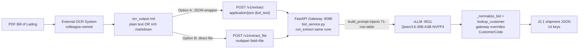

# MDPL Bill of Lading Extractor — Customer Table Incorporation (v4.0)

> **Source of Truth for the Builder.** Status: **READY TO BUILD.**
> This document supersedes v3.2 (which was `VERIFIED — NO BUILD REQUIRED`).
> v4.0 incorporates the colleague's 71-row customer table (`customer table.csv`,
> `C-MDPL0001`–`C-MDPL0071`) as the new `DEFAULT_CUSTOMER_TABLE`.
>
> Pipeline (unchanged, hardwired): `PDF → OCR (separate system, colleague-owned)
> → OCR output as .md/.txt text file → THIS gateway → J2.1 shipment JSON`.
> This gateway **never** handles PDF/image bytes and never starts/stops the model server.
>
> Socratic decisions D8–D11 (2026-09-15, user-confirmed via interrogation):
> **D8** schema mapping = copy `CONSIGNEE NAME` to both `Buyer` and
> `RegisteredCustomerName`; **D9** replacement = 71 rows fully REPLACE the 4 old
> rows, golden `C0003 → C-MDPL0001`; **D10** storage = hardcode as new defaults
> in `bol_service.py`; **D11** cleaning = drop empty row, strip whitespace /
> one trailing comma, keep everything else verbatim, keep ambiguity guard.

---

## 1. Strategic Design

### 1.1 Objectives

1. **Replace the placeholder table:** `DEFAULT_CUSTOMER_TABLE` in `bol_service.py`
   goes from 4 rows (`C0002/C0003/C0005/C0006`, v2.1 spec §3) to **71 rows**
   (`C-MDPL0001`–`C-MDPL0071`) from `customer table.csv`.
2. **Preserve the contract:** 14-key J2.1 schema, `AssistantVersion="J2.1"`,
   placeholders `N/A`/`0`, POST-only endpoints, gateway-authoritative
   `lookup_customer`. No prompt-logic, matching-logic, or API change —
   data-only swap + test/doc updates.
3. **Fix the golden sample:** `tests/cases/bol_golden_expected.json`
   `CustomerCode: "C0003"` → `"C-MDPL0001"` (same entity `ANA FOODS CO., LTD.`).
   Input `.txt` is unchanged.
4. **Keep docs + config in sync:** `.env.example`, `bol-prompts.md`,
   `README.md` must stop referencing the 4 old codes.
5. **Stay green:** `pytest tests/test_extract.py -q` → **104 passed** after the swap.

### 1.2 Architecture



**Request flow inside gateway (unchanged, both endpoints converge):**

```text
POST /v1/extract         ─┐
  {bol_text: str}         ├─→ load_customer_table() → run_extract({bol_text}, table, http_model_call)
POST /v1/extract_file    ─┘         ↑                                              ↑
  file: UploadFile (.md) ── _read_md_upload() ── {bol_text: decoded str} ─────────┘
                                                    (build_prompt → check_context → model_call → extract_json)
```

**Why 71 rows fit (no code change):** `build_prompt()` renders one line per row
(`- Code=… | Buyer=… | RegisteredCustomerName=…`). 71 rows ≈ 9–10k chars ≈
≈3.1–3.4k tokens by the `chars/3` heuristic, vs `usable_prompt_room() = 28216`
tokens at defaults. Headroom remains >24k tokens for `BOL_DATA`. No
`CONTEXT_SIZE` / `MODEL_MAX_TOKENS` / `_max_upload_chars` change required.

### 1.3 API Definitions (unchanged in v4.0)

All endpoints require `x-api-key` except `GET /` and `GET /healthz`. Docs at `/docs`.
`GET /v1/extract*` intentionally does **not** exist (`405` is correct).

| Endpoint | Method | Request | Success | Notes |
|---|---|---|---|---|
| `/` | GET | — | `200 {service, version, endpoints, docs}` | Unchanged |
| `/healthz` | GET | — | `200 {status, model_server, context_budget, version}` | `customer_table_rows` becomes `71` |
| `/v1/extract` | POST | `application/json {"bol_text": string(min 1)}` | `200 J2.1 JSON` | Unchanged |
| `/v1/extract_file` | POST | `multipart/form-data`, field `file: (.md/.markdown/.txt)` UTF-8 | `200 J2.1 JSON` | Unchanged |
| `/v1/extract_batch` | POST | `{"entries": [{id?, bol_text}]}` | `200 {results: [...]}` | Unchanged |
| `/v1/version` | POST | — | `200 {"version": "J2.1"}` | Unchanged |

### 1.4 Data Schemas

**J2.1 output (authoritative — `_normalize_bol`, 14 keys, unchanged):**

```json
{
  "AssistantVersion": "J2.1",
  "BLNumber": "string",
  "BLDate": { "Month": 0, "Day": 0, "Year": 0 },
  "CustomerName": "string",
  "CustomerCode": "string",
  "CustomerAddress": "string",
  "Shipper": "string",
  "ShipperAddress": "string",
  "ShipToDestination": { "City": "string", "Country": "string" },
  "ShipVia": "string",
  "VoyageNumber": "string",
  "Brand": "string",
  "PortOfOrigin": "string",
  "Cartons": 0
}
```

**Customer table schema (unchanged shape, new rows):**

```python
{"Code": str, "Buyer": str, "RegisteredCustomerName": str}
# D8: Buyer == RegisteredCustomerName == cleaned CONSIGNEE NAME for all 71 rows
```

**Authoritative cleaned table (71 rows — Builder: paste verbatim as new `DEFAULT_CUSTOMER_TABLE`):**

> Source: `customer table.csv` pasted 2026-09-15. Cleaning per D11: drop the
> empty `,` row; strip surrounding whitespace/quotes; strip ONE trailing `,`
> (`C-MDPL0013` `XAG PHILIPPINES INC.,` → `XAG PHILIPPINES INC.`); keep all
> other casing/punctuation verbatim (incl. lowercase `C-MDPL0071` — matching is
> case-insensitive so do NOT uppercase it).

```python
DEFAULT_CUSTOMER_TABLE: list[dict] = [
    {"Code": "C-MDPL0001", "Buyer": "ANA FOODS CO., LTD.", "RegisteredCustomerName": "ANA FOODS CO., LTD."},
    {"Code": "C-MDPL0002", "Buyer": "ASIA GLOBAL INTERNATIONAL FREIGHT (SHANGHAI) CO., LTD", "RegisteredCustomerName": "ASIA GLOBAL INTERNATIONAL FREIGHT (SHANGHAI) CO., LTD"},
    {"Code": "C-MDPL0003", "Buyer": "EACHTAKE (CHINA) LIMITED", "RegisteredCustomerName": "EACHTAKE (CHINA) LIMITED"},
    {"Code": "C-MDPL0004", "Buyer": "FARMIND CORPORATION", "RegisteredCustomerName": "FARMIND CORPORATION"},
    {"Code": "C-MDPL0005", "Buyer": "SHANGHAI SOFIA INTERNATIONAL TRADING CO.LTD.", "RegisteredCustomerName": "SHANGHAI SOFIA INTERNATIONAL TRADING CO.LTD."},
    {"Code": "C-MDPL0006", "Buyer": "FELIZA FRESH FRUIT CORP.", "RegisteredCustomerName": "FELIZA FRESH FRUIT CORP."},
    {"Code": "C-MDPL0007", "Buyer": "HANDS IN HANDS CO., LTD", "RegisteredCustomerName": "HANDS IN HANDS CO., LTD"},
    {"Code": "C-MDPL0008", "Buyer": "ASIAFRESH VENTURES CORP.", "RegisteredCustomerName": "ASIAFRESH VENTURES CORP."},
    {"Code": "C-MDPL0009", "Buyer": "CULTIVATION GROUP LIMITED", "RegisteredCustomerName": "CULTIVATION GROUP LIMITED"},
    {"Code": "C-MDPL0010", "Buyer": "BEIJING YONGXIN HENGCHANG FRUIT CO. LTD", "RegisteredCustomerName": "BEIJING YONGXIN HENGCHANG FRUIT CO. LTD"},
    {"Code": "C-MDPL0011", "Buyer": "HELON INTERNATIONAL TRADING CORPORATION", "RegisteredCustomerName": "HELON INTERNATIONAL TRADING CORPORATION"},
    {"Code": "C-MDPL0012", "Buyer": "S&N FRUITS CORPORATION", "RegisteredCustomerName": "S&N FRUITS CORPORATION"},
    {"Code": "C-MDPL0013", "Buyer": "XAG PHILIPPINES INC.", "RegisteredCustomerName": "XAG PHILIPPINES INC."},
    {"Code": "C-MDPL0014", "Buyer": "SHANGHAO FRUIT", "RegisteredCustomerName": "SHANGHAO FRUIT"},
    {"Code": "C-MDPL0015", "Buyer": "SHANGHAI JIEFU FRUIT INDUSTRIAL CO., LTD.", "RegisteredCustomerName": "SHANGHAI JIEFU FRUIT INDUSTRIAL CO., LTD."},
    {"Code": "C-MDPL0016", "Buyer": "LEEWARD INTERNATIONAL TRADING LTD.", "RegisteredCustomerName": "LEEWARD INTERNATIONAL TRADING LTD."},
    {"Code": "C-MDPL0017", "Buyer": "SARAP FRUITS AGRIVENTURE, INC.", "RegisteredCustomerName": "SARAP FRUITS AGRIVENTURE, INC."},
    {"Code": "C-MDPL0018", "Buyer": "SHANGHAI HAODONG INTERNATIONAL TRADE LTD.", "RegisteredCustomerName": "SHANGHAI HAODONG INTERNATIONAL TRADE LTD."},
    {"Code": "C-MDPL0019", "Buyer": "HELON - SUNOVI INTERNATIONAL TRADING(DALIAN)CO.,LTD", "RegisteredCustomerName": "HELON - SUNOVI INTERNATIONAL TRADING(DALIAN)CO.,LTD"},
    {"Code": "C-MDPL0020", "Buyer": "HELON - SHANGHAI HAODONG INTERNATIONAL TRADE, LTD", "RegisteredCustomerName": "HELON - SHANGHAI HAODONG INTERNATIONAL TRADE, LTD"},
    {"Code": "C-MDPL0021", "Buyer": "HELON - SHANGHAI JIAYUANXIN IMPORT AND EXPORT CO., LTD", "RegisteredCustomerName": "HELON - SHANGHAI JIAYUANXIN IMPORT AND EXPORT CO., LTD"},
    {"Code": "C-MDPL0022", "Buyer": "HELON - LINGXIAN (TIANJIN) INTERNATIONAL SUPPLY CHAIN CO., LTD", "RegisteredCustomerName": "HELON - LINGXIAN (TIANJIN) INTERNATIONAL SUPPLY CHAIN CO., LTD"},
    {"Code": "C-MDPL0023", "Buyer": "HELON - SHANGHAI RONGLI CHENHE IMPORT AND EXPORT CO., LTD.", "RegisteredCustomerName": "HELON - SHANGHAI RONGLI CHENHE IMPORT AND EXPORT CO., LTD."},
    {"Code": "C-MDPL0024", "Buyer": "HIRO INTERNATIONAL CO., LTD", "RegisteredCustomerName": "HIRO INTERNATIONAL CO., LTD"},
    {"Code": "C-MDPL0025", "Buyer": "JINWON TRADING CO., LTD.", "RegisteredCustomerName": "JINWON TRADING CO., LTD."},
    {"Code": "C-MDPL0026", "Buyer": "JOY FARMIND SUPPLY CHAIN MANAGEMENT LIMITED", "RegisteredCustomerName": "JOY FARMIND SUPPLY CHAIN MANAGEMENT LIMITED"},
    {"Code": "C-MDPL0027", "Buyer": "LAYSUN (FAR EAST) LIMITED", "RegisteredCustomerName": "LAYSUN (FAR EAST) LIMITED"},
    {"Code": "C-MDPL0028", "Buyer": "MOHAMMED ABDALLAH SHARBATLY CO., LTD.", "RegisteredCustomerName": "MOHAMMED ABDALLAH SHARBATLY CO., LTD."},
    {"Code": "C-MDPL0029", "Buyer": "PACIFIC FRESH CO., LTD", "RegisteredCustomerName": "PACIFIC FRESH CO., LTD"},
    {"Code": "C-MDPL0030", "Buyer": "PACWEST TRADING (SHANGHAI) CO., LTD.", "RegisteredCustomerName": "PACWEST TRADING (SHANGHAI) CO., LTD."},
    {"Code": "C-MDPL0031", "Buyer": "SHANGHAI JIEFU - SHANGHAI CHENGUAN IMPORT & EXPORT CO., LTD", "RegisteredCustomerName": "SHANGHAI JIEFU - SHANGHAI CHENGUAN IMPORT & EXPORT CO., LTD"},
    {"Code": "C-MDPL0032", "Buyer": "SHANGHAI GOODFARMER BANANA CO, LTD.", "RegisteredCustomerName": "SHANGHAI GOODFARMER BANANA CO, LTD."},
    {"Code": "C-MDPL0033", "Buyer": "SHANGHAO FRUIT - SHENZHEN ZHONGQINGDA INTERNATIONAL TRADER CO., LTD", "RegisteredCustomerName": "SHANGHAO FRUIT - SHENZHEN ZHONGQINGDA INTERNATIONAL TRADER CO., LTD"},
    {"Code": "C-MDPL0034", "Buyer": "XIANFENG (HONG KONG) COMPANY LIMITED", "RegisteredCustomerName": "XIANFENG (HONG KONG) COMPANY LIMITED"},
    {"Code": "C-MDPL0035", "Buyer": "AGSOUTH FRUITS PACIFIC BRANCH OFFICE", "RegisteredCustomerName": "AGSOUTH FRUITS PACIFIC BRANCH OFFICE"},
    {"Code": "C-MDPL0036", "Buyer": "FELIZA - XIAMEN TINGYUAN TRADING CO., LTD.", "RegisteredCustomerName": "FELIZA - XIAMEN TINGYUAN TRADING CO., LTD."},
    {"Code": "C-MDPL0037", "Buyer": "FELIZA - SOFIA INTERNATIONAL TRADING (DALIAN) CO., LTD.", "RegisteredCustomerName": "FELIZA - SOFIA INTERNATIONAL TRADING (DALIAN) CO., LTD."},
    {"Code": "C-MDPL0038", "Buyer": "PACWEST - SHANGHAI RONGLI CHENHE IMPORT AND EXPORT CO., LTD.", "RegisteredCustomerName": "PACWEST - SHANGHAI RONGLI CHENHE IMPORT AND EXPORT CO., LTD."},
    {"Code": "C-MDPL0039", "Buyer": "PACIFIC FRESH - KYUNGYEON TRADING CO., LTD", "RegisteredCustomerName": "PACIFIC FRESH - KYUNGYEON TRADING CO., LTD"},
    {"Code": "C-MDPL0040", "Buyer": "PACIFIC FRESH - SUNRIDGE LIMITED", "RegisteredCustomerName": "PACIFIC FRESH - SUNRIDGE LIMITED"},
    {"Code": "C-MDPL0041", "Buyer": "SHANGHAO FRUIT - SHANGHAI HAODONG INTERNATIONAL TRADE, LTD", "RegisteredCustomerName": "SHANGHAO FRUIT - SHANGHAI HAODONG INTERNATIONAL TRADE, LTD"},
    {"Code": "C-MDPL0042", "Buyer": "SHANGHAI JIEFU - SHEN ZHEN HUILAI INDUSTRY DEVELOPMENT CO., LTD.", "RegisteredCustomerName": "SHANGHAI JIEFU - SHEN ZHEN HUILAI INDUSTRY DEVELOPMENT CO., LTD."},
    {"Code": "C-MDPL0043", "Buyer": "UNIFRUTTI JAPAN CORPORATION", "RegisteredCustomerName": "UNIFRUTTI JAPAN CORPORATION"},
    {"Code": "C-MDPL0044", "Buyer": "KWEK GLOBAL PTE LTD", "RegisteredCustomerName": "KWEK GLOBAL PTE LTD"},
    {"Code": "C-MDPL0045", "Buyer": "TIANJIN CAIYU INTERNATIONAL TRADE CO., LTD.", "RegisteredCustomerName": "TIANJIN CAIYU INTERNATIONAL TRADE CO., LTD."},
    {"Code": "C-MDPL0046", "Buyer": "GLOBE PACIFIC TRADING LTD. (NEH)", "RegisteredCustomerName": "GLOBE PACIFIC TRADING LTD. (NEH)"},
    {"Code": "C-MDPL0047", "Buyer": "CENTRAL CHAMBERS LAW CORPORATION", "RegisteredCustomerName": "CENTRAL CHAMBERS LAW CORPORATION"},
    {"Code": "C-MDPL0048", "Buyer": "CHAMBERS RESOURCES PTE LTD", "RegisteredCustomerName": "CHAMBERS RESOURCES PTE LTD"},
    {"Code": "C-MDPL0049", "Buyer": "DOROTHY ISABEL DRYSDALE", "RegisteredCustomerName": "DOROTHY ISABEL DRYSDALE"},
    {"Code": "C-MDPL0050", "Buyer": "DRYSDALE ENTERPRISES", "RegisteredCustomerName": "DRYSDALE ENTERPRISES"},
    {"Code": "C-MDPL0051", "Buyer": "FRANK M. AYRE", "RegisteredCustomerName": "FRANK M. AYRE"},
    {"Code": "C-MDPL0052", "Buyer": "GARHWAL CHAN & WILLIAMS", "RegisteredCustomerName": "GARHWAL CHAN & WILLIAMS"},
    {"Code": "C-MDPL0053", "Buyer": "GEORGE M. DRYSDALE", "RegisteredCustomerName": "GEORGE M. DRYSDALE"},
    {"Code": "C-MDPL0054", "Buyer": "GEORGE ROGERS MARSMAN DRYSDALE", "RegisteredCustomerName": "GEORGE ROGERS MARSMAN DRYSDALE"},
    {"Code": "C-MDPL0055", "Buyer": "INLAND REVENUE AUTHORITY OF SINGAPORE", "RegisteredCustomerName": "INLAND REVENUE AUTHORITY OF SINGAPORE"},
    {"Code": "C-MDPL0056", "Buyer": "LEY AND HOWE CORPORATE SERVICES PTE LTD.", "RegisteredCustomerName": "LEY AND HOWE CORPORATE SERVICES PTE LTD."},
    {"Code": "C-MDPL0057", "Buyer": "MARSMAN DRYSDALE II LLC", "RegisteredCustomerName": "MARSMAN DRYSDALE II LLC"},
    {"Code": "C-MDPL0058", "Buyer": "MARSMAN ESTATE PLANTATION INC.", "RegisteredCustomerName": "MARSMAN ESTATE PLANTATION INC."},
    {"Code": "C-MDPL0059", "Buyer": "MARY BLYTHE DRYSDALE", "RegisteredCustomerName": "MARY BLYTHE DRYSDALE"},
    {"Code": "C-MDPL0060", "Buyer": "MARSMAN DRYSDALE INTERNATIONAL HOLDINGS, INC.", "RegisteredCustomerName": "MARSMAN DRYSDALE INTERNATIONAL HOLDINGS, INC."},
    {"Code": "C-MDPL0061", "Buyer": "MD INTERNATIONAL LIMITED", "RegisteredCustomerName": "MD INTERNATIONAL LIMITED"},
    {"Code": "C-MDPL0062", "Buyer": "MD ISALON ORGANIC BANANA AGRI-VENTURES", "RegisteredCustomerName": "MD ISALON ORGANIC BANANA AGRI-VENTURES"},
    {"Code": "C-MDPL0063", "Buyer": "MD NABUNTURAN AGRI-VENTURES INC.", "RegisteredCustomerName": "MD NABUNTURAN AGRI-VENTURES INC."},
    {"Code": "C-MDPL0064", "Buyer": "MD PANABO AGRI-VENTURES INC.", "RegisteredCustomerName": "MD PANABO AGRI-VENTURES INC."},
    {"Code": "C-MDPL0065", "Buyer": "MD RIO VISTA AGRI-VENTURES, INC.", "RegisteredCustomerName": "MD RIO VISTA AGRI-VENTURES, INC."},
    {"Code": "C-MDPL0066", "Buyer": "NEW JAPAN PRODUCE CO. LTD.", "RegisteredCustomerName": "NEW JAPAN PRODUCE CO. LTD."},
    {"Code": "C-MDPL0067", "Buyer": "SINGAPORE BUSINESS FEDERATION", "RegisteredCustomerName": "SINGAPORE BUSINESS FEDERATION"},
    {"Code": "C-MDPL0068", "Buyer": "THE MARSMAN-DRYSDALE FOUNDATION INC.", "RegisteredCustomerName": "THE MARSMAN-DRYSDALE FOUNDATION INC."},
    {"Code": "C-MDPL0069", "Buyer": "THONG & LIM CONSULTANTS PTE LTD", "RegisteredCustomerName": "THONG & LIM CONSULTANTS PTE LTD"},
    {"Code": "C-MDPL0070", "Buyer": "MD DAVAO AGRI-VENTURES INC.", "RegisteredCustomerName": "MD DAVAO AGRI-VENTURES INC."},
    {"Code": "C-MDPL0071", "Buyer": "Shanghai Rongli Chenhe Import and Export Co., Ltd.", "RegisteredCustomerName": "Shanghai Rongli Chenhe Import and Export Co., Ltd."},
]
```

**Golden change (D9):** `tests/cases/bol_golden_expected.json`
`CustomerCode: "C0003"` → `"C-MDPL0001"`. All other 13 keys byte-identical.
Input `bol_golden_input.txt` (consignee `ANA FOODS CO., LTD`) is unchanged —
it now resolves to the new code.

### 1.5 Constraints (C1–C12 carried + D8–D11 new)

- **C1–C8 (v3.1/v3.2, still binding).** POST-only; single small UTF-8 `.md`/`.txt`;
  reuse `run_extract` (no fork); gateway-only shared vLLM (`:8011`,
  `Qwen3.6-35B-A3B-NVFP4`, `CONTEXT_SIZE=32768`, `API_PORT=8086`); backward
  compatible endpoints; auth + status ladder `405→401→422→503→500`;
  dependency-minimal; Windows-dev testable with stub.
- **C9 (D4).** Contract Class stays dropped. 14 keys only.
- **C10 (D5).** Plain + rich markdown both pass through opaquely. No preprocessing.
- **C11 (D6).** Placeholders `N/A + 0` contractual (no `null`).
- **C12 (D7).** v3.2 was verify-only; v4.0 is a data swap (this roadmap).
- **C13 (D8). Schema mapping is fixed.** `Buyer == RegisteredCustomerName ==
  cleaned CONSIGNEE NAME`. Do NOT invent distinct `Buyer` values; do NOT leave
  `Buyer` empty (empty weakens the step-2 exact-match path in `lookup_customer`).
- **C14 (D9). Replacement is total.** Delete the 4 old rows. Old codes
  `C0002/C0003/C0005/C0006` must appear NOWHERE in code, tests, golden, or docs
  after v4.0 (except this file's history note). Golden `C0003 → C-MDPL0001` is
  intentional, not a regression.
- **C15 (D10). Storage is in-code defaults.** Edit `DEFAULT_CUSTOMER_TABLE`
  in-place in `bol_service.py`. Do NOT set `CUSTOMER_TABLE` env in code or
  `.env`; do NOT create new modules/files; preserve `load_customer_table()`
  fallback and `model_call` injection. Single-file app invariant holds.
- **C16 (D11). Cleaning is minimal + verbatim.** Drop empty row; strip
  whitespace; `C-MDPL0013` trailing-comma strip only. Keep `C-MDPL0071`
  lowercase as-is. `lookup_customer`, `_normalize_name`, ambiguity guard
  (`ambiguous → "N/A"`) are FROZEN — no logic change.
- **C17. Prompt-budget invariant.** 71 rows must still pass
  `test_context_budget_32k_default` / `test_usable_prompt_room_vllm_budget`.
  No `CONTEXT_SIZE` / `MODEL_MAX_TOKENS` / `_SAFETY_MARGIN` change.

### 1.6 Edge Cases & Failure Modes

| Scenario | Handling |
|---|---|
| `ANA FOODS CO., LTD` (golden) now matches `C-MDPL0001` | Gateway `lookup_customer` returns `C-MDPL0001`; golden updated to match. Old `C0003` is gone. |
| Old codes `C0002/C0005/C0006` in a live B/L | Now resolve to `"N/A"` (no row matches) — correct per D9 deprecation. `CustomerName` kept verbatim. |
| `SHANGHAO FRUIT` (C-MDPL0014) vs `SHANGHAO FRUIT - …` (C-MDPL0033/C-MDPL0041) | Exact normalized match wins when document equals one row exactly. Substring-only queries spanning two codes → `"N/A"` (ambiguity guard, never guess). |
| `HELON - …` family (C-MDPL0019–C-MDPL0023) + bare `HELON INTERNATIONAL…` (C-MDPL0011) | Same rule: exact wins; bare `HELON` substring matching >1 code → `"N/A"`. |
| `FELIZA…` / `PACIFIC FRESH…` / `PACWEST…` / `SHANGHAI JIEFU…` families | Same ambiguity guard. Document must carry the full consignee string to resolve. |
| `XAG PHILIPPINES INC.` with/without trailing comma | `_normalize_name` strips `.,&'"` punctuation, so both forms normalize identically → `C-MDPL0013`. Cleaning the CSV comma is cosmetic; matching is robust either way. |
| `C-MDPL0071` lowercase in table vs uppercase in document | `_normalize_name` lowercases → match succeeds. Do not re-case the table. |
| Empty CSV row (`,`) | Dropped at authoring time; never enters the table. `load_customer_table()` malformed-row filter remains as defense-in-depth. |
| `CUSTOMER_TABLE` env set in some deploy | `load_customer_table()` still honors env override (unchanged). Default path (empty env) now yields 71 rows; `/healthz customer_table_rows == 71`. |
| Prompt still fits context | 71-row prompt ≈ 3.4k tokens ≪ 28216 room. Oversized-`bol_text` still `422` via `check_context`; behavior unchanged. |
| Stale references to `C0003` in logs/tests/docs | All must be updated (Roadmap B2–B3). Any remaining `C0002/C0003/C0005/C0006` literal outside this history section is a defect. |

---

## 2. The Execution Roadmap — Build Checklist (v4.0)

> Sequential. Dependencies ordered: **Table → Golden → Tests → Docs → Verify**.
> Builder: check off in order; stop and escalate to Architect if any verify step fails.

### Phase B0: Pre-flight (read-only)

- [ ] Read `bol_service.py:178-183` (`DEFAULT_CUSTOMER_TABLE`), `tests/test_extract.py:248-340` (`TestLookupCustomer`/`TestLoadCustomerTable`), `tests/cases/bol_golden_expected.json`, `.env.example:54-60`, `bol-prompts.md:66-83`, `README.md:135-150`
- [ ] Confirm working tree clean (`git status --short`) and baseline green (`python -m pytest tests/test_extract.py -q` → 104 passed before edits)

### Phase B1: Swap the table (code, in-place only)

- [ ] Replace `DEFAULT_CUSTOMER_TABLE` in `bol_service.py` with the 71-row literal from §1.4 (verbatim, `Buyer == RegisteredCustomerName`, `C-MDPL0013` without trailing comma, `C-MDPL0071` lowercase kept)
- [ ] Update the comment above it: `Built-in defaults from the colleague's customer table.csv (71 rows, C-MDPL0001–C-MDPL0071). Used when CUSTOMER_TABLE env is unset/empty or unparseable.`
- [ ] Do NOT touch `load_customer_table`, `lookup_customer`, `_normalize_name`, prompt builders, endpoints, or vLLM config

### Phase B2: Fix the golden contract

- [ ] Edit `tests/cases/bol_golden_expected.json`: `"CustomerCode": "C0003"` → `"CustomerCode": "C-MDPL0001"` (single-line change, no other key touched)
- [ ] Do NOT touch `tests/cases/bol_golden_input.txt`

### Phase B3: Update the test suite (pin new reality)

- [ ] `TestGoldenSample::test_prompt_contains_customer_table_and_fences`: assert `"C-MDPL0001"` in user message (replace `"C0003"`); optionally also assert `"C-MDPL0071"` present and `"C0003"` absent
- [ ] `TestNormalizeBol::test_extract_json_gateway_side_customer_resolution`: expect `"C-MDPL0001"` (replace `"C0003"`)
- [ ] `TestLookupCustomer`: retarget to new codes — e.g. exact `ANA Foods Co., LTD → C-MDPL0001`, case-insensitive same, punctuation/bracket `LAYSUN (FAR EAST) LIMITED → C-MDPL0027`, buyer `HIRO INTERNATIONAL CO., LTD → C-MDPL0024` / `FARMIND CORPORATION → C-MDPL0004`, substring `ANA FOODS CO., LTD (TOKYO BRANCH) → C-MDPL0001`; keep no-match/empty/None/ambiguity tests as-is (ambiguity fixture codes `X001/X002` untouched)
- [ ] `TestLoadCustomerTable::test_env_empty_uses_defaults`: expect `len == 71` and `{"C-MDPL0001", "C-MDPL0071", …}` (replace `len == 4` / `C0002/C0003/C0005/C0006` set)
- [ ] `test_invalid_json_falls_back_to_defaults`, `test_non_array_falls_back_to_defaults`, `test_all_invalid_rows_fall_back_to_defaults`: expect `len == 71` (replace `4`)
- [ ] `test_defaults_are_not_mutated`: still compares before/after (no constant change needed, but verify it passes with 71 rows)
- [ ] `grep -rn "C0002\|C0003\|C0005\|C0006" --include="*.py" --include="*.json" .` → zero hits outside `implementation.md` history

### Phase B4: Sync docs + config comments (no behavior change)

- [ ] `.env.example:54-60` comment: `Leave empty ("") to use the built-in defaults (71 rows, C-MDPL0001–C-MDPL0071 from customer table.csv).` (replace `C0002/C0003/C0005/C0006` line)
- [ ] `bol-prompts.md` User Message Template: replace the 4 example `- Code=…` lines with 3 representative new lines (e.g. `C-MDPL0001`, `C-MDPL0004`, `C-MDPL0027`) + `… (71 rows total; full list in implementation.md §1.4)`; fix stale header `Qwen3.8-27B` → `Qwen3.6-35B-A3B-NVFP4` only if touching the file anyway (otherwise leave; logged tech debt T1)
- [ ] `README.md` Registered Customer Lookup section: replace `C0002/C0003/C0005/C0006` with `C-MDPL0001–C-MDPL0071 (71 rows)`; example `CUSTOMER_TABLE` JSON stays valid; example response `CustomerCode: C0003` → `C-MDPL0001`
- [ ] Do NOT change any endpoint, port, model name, or context math in docs beyond the lines above

### Phase B5: Verify (green gate)

- [ ] `python -m pytest tests/test_extract.py -q` → **104 passed** (count unchanged; only assertions retargeted)
- [ ] `python -m pytest tests/test_extract.py::TestGoldenSample tests/test_extract.py::TestLookupCustomer tests/test_extract.py::TestLoadCustomerTable -v` → all pass
- [ ] Manual spot check (stub-free logic): `python -c "import bol_service as b; t=b.load_customer_table(); print(len(t)); print(b.lookup_customer('ANA FOODS CO., LTD', t)); print(b.lookup_customer('LAYSUN (FAR EAST) LIMITED', t)); print(b.lookup_customer('SHANGHAO FRUIT', t))"` → `71 / C-MDPL0001 / C-MDPL0027 / C-MDPL0014`
- [ ] Manual ambiguity check: `lookup_customer('SHANGHAO FRUIT - SHANGHAI HAODONG INTERNATIONAL TRADE, LTD', t)` → `C-MDPL0041`; `lookup_customer('HELON', t)` → `N/A` (multi-code substring, guard holds)
- [ ] `grep -rni "C0003" README.md bol-prompts.md .env.example tests/ bol_service.py` → zero hits (excluding this file)
- [ ] DGX pre-flight (deploy time, not Windows): `./start.sh` → `/healthz` shows `customer_table_rows: 71` → golden `.txt` via both `POST /v1/extract` and `POST /v1/extract_file` returns `C-MDPL0001`

### Phase B6: Deferred tech debt (explicitly OUT of scope)

- [ ] **T1.** README drift (ports `8006`/`Qwen3.8-27B`/`65536` vs live `8011`/`Qwen3.6`/`32768`) — still deferred unless touched in B4.
- [ ] **T2.** If ops later wants the 71 rows via `CUSTOMER_TABLE` env instead of defaults, supply a JSON dump — no code change needed (`load_customer_table` already supports it).

---

## 3. Reference

| Item | Value |
|---|---|
| Gateway port | `8086` (`API_PORT`) |
| vLLM | `:8011`, `Qwen3.6-35B-A3B-NVFP4`, `CONTEXT_SIZE=32768` |
| Prompt room | `32768-4096-256 = 28216 tokens ≈ 84648 chars cap` |
| 71-row table cost | `≈ 9–10k chars ≈ 3.1–3.4k tokens` — headroom >24k tokens |
| Auth | `x-api-key: bol_key_0000` (dev) |
| Golden | `tests/cases/bol_golden_input.txt` → `bol_golden_expected.json` (BL `YKO2604155`, code `C-MDPL0001` after v4.0) |
| Source CSV | `customer table.csv` (colleague-supplied; `CODE,CONSIGNEE NAME`; 71 data rows after dropping 1 empty row) |
| Spec | `AI_MDPL_BILL_OF_LADING.md` v2.1 (J2.1); §5 schema authoritative; §3 4-row table superseded by colleague CSV per D9 |
| Suite | `104 passed` baseline v3.2; must stay `104 passed` after v4.0 retarget |

## 4. Builder Notes

- **Data swap only.** Any logic change to `lookup_customer`, `_normalize_name`, `build_prompt`, `check_context`, endpoints, or vLLM params is OUT OF SCOPE — escalate to Architect first.
- **Single-file app.** Change stays in-place in `bol_service.py`; no new modules, no restructure; preserve `model_call` injection.
- **Never write uploads to disk; never add GET handlers; never change J2.1 schema; never touch the vLLM server.**
- **Order on build:** B0 → B1 → B2 → B3 → B4 → B5. Then close. B6 deferred.
